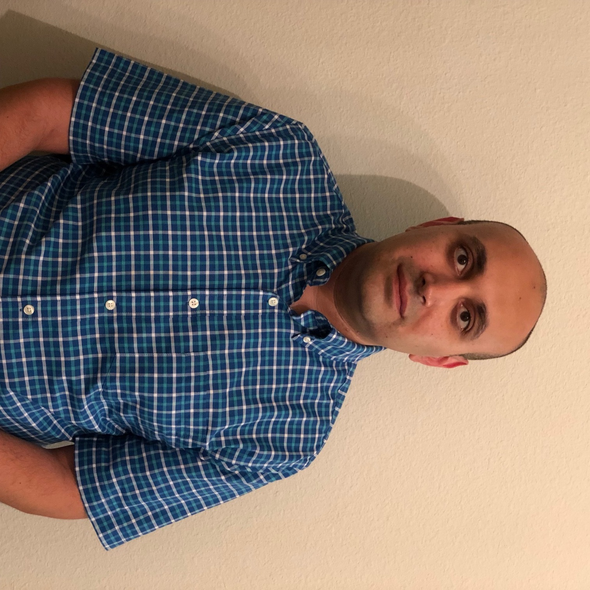

 
    

 Umberto Villa   Research Associate

 Center for Computational Geophysics and Optimization   (Director: O. Ghattas) 

 <a href="files/UmbertoVilla_cv.pdf">Curriculum vitae </a> 

 

I am currently a Research Associate at [The Institute for Computational Engineering and Sciences (ICES)](http://ices.utexas.edu/) of [The University of Texas at Austin](http://utexas.edu/). 
I am a member of the [Center for Computational Oncology]( http://cco.ices.utexas.edu) led by [Dr. Thomas E. Yankeelov]( http://cco.ices.utexas.edu/members/thomas-yankeelov/). Mu current research is focused on multiscale (subcell-tissue) modeling of tumor growth and computational frameworks for data-enabled predictive modeling with applications to multiphase materials deformation and biological growth.
I joined ICES in January 2013 working with [Prof. J. Tinsley Oden]( https://www.ices.utexas.edu/people/85/) on Bayesian methods for validation of physics-based models of complex materials and biological systems as well as uncertainty quantification and propagation. 
In December 2012, I obtained my Ph.D. in Civil Engineering with specialization in theoretical and computational nonlocal continuum mechanics for modeling microscale metallic systems from [Louisiana State University]( https://www.lsu.edu/), with [Prof. George Z. Voyiadjis]( http://www.lsu.edu/eng/cee/people/voyiadjis.php) serving as my principal advisor.
