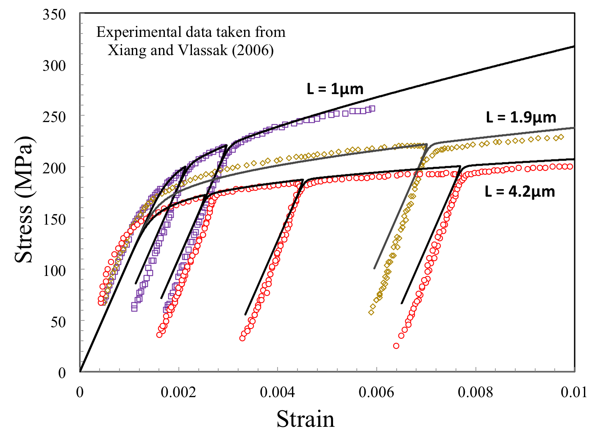

## Research highlights
My interests are directed towards mathematical modeling of complex materials and biological systems as well as data-enabled statistical and computational methods for predictive modeling of physical phenomena with quantified uncertainties.
My research areas of expertise are 

* Multiscale and Multiphysics Modeling
* Nonlinear and Nonlocal Theories of Continuum Solid Mechanics
* Reduced Order Modeling of Molecular Systems
* Couple Particle and Continuum Modeling
* Data-Enabled Predictive Science
* Bayesian Model Validation and Uncertainty Quantification
* Science and Engineering Applications: 
* Advanced micro- and nano-manufacturing of engineering materials, 
* Tumor modeling and image derived treatment, 
* Nonlinear and failure processes in structures/materials under extreme conditions, and other complex systems.

Find me on: [Google Scholar](https://scholar.google.com/citations?user=BAE0ndIAAAAJ&hl=en&oi=ao).

|  |  | 
| :---: | :---: | :---:|
| DDDAS framework for realtime monitoring and control of material damage | Hybrid agent based-continuum model cancer cell evolution calibrated and validated by in vitro imaging data | 
| :---: | :---: | :---:|
|  |   | 
| :---: | :---: | :---:|
| Nonlocal continuum theory to capture size effect in plastic deformation of microscale thin metal film | Coarse-graning of atomistic system: Bayesian model validation with quantified uncertainty | 